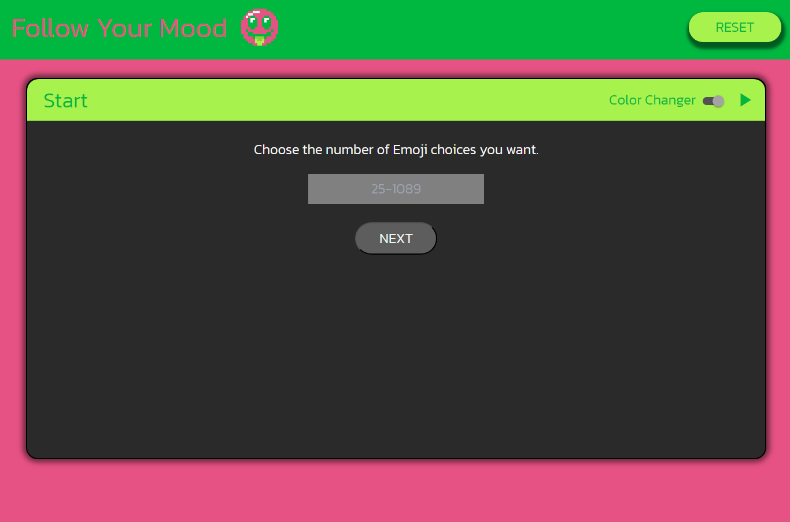
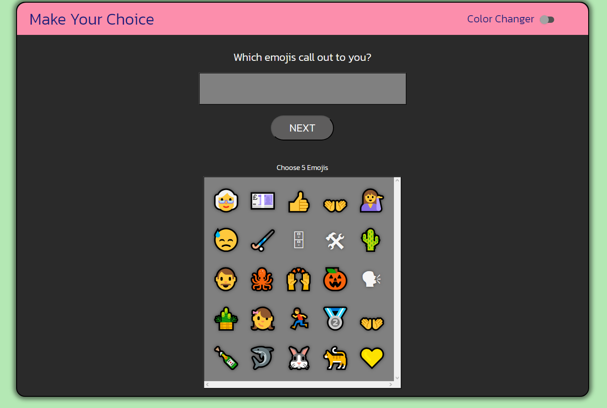
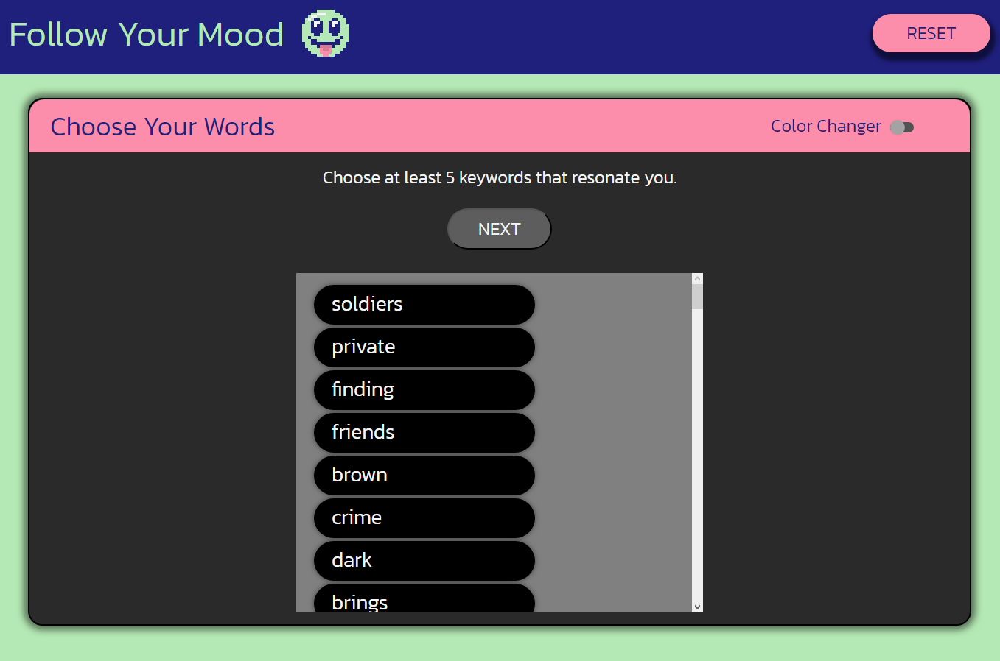
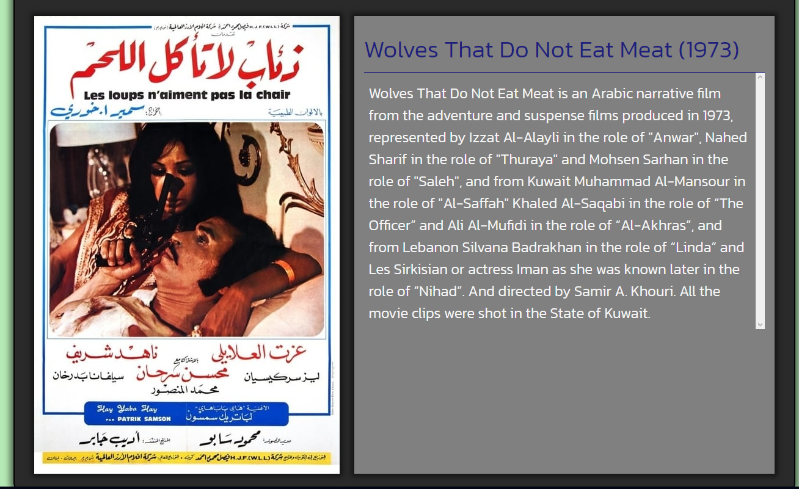

## About The Application ## 
This application grabs user inputs describing their mood in the form of keywords, and then suggests a movie based off the keywords given.

The Application uses Dictionary API to take user inputted words, check if they're real words, and then grab the word and synonyms to use as keywords.

The application then searches TMDB with the given peramaters to fetch and display a movie that best suits the users mood.

## User Story ## 
I as a user dont know what to watch
When I load up the app I am asked to describe my current mood using 5
emojis
THEN I am asked to answer a question pertaing to my past experiences
THEN I am asked to select what Keywords best fit my mood right now
When I give all these inputs
THEN the application shows me a movie based on my inputs

## Pictures of the Application! ##

## Where to find the Project ##

Repository 
https://github.com/Shaontae/Mood-Based-Movie-Selector

Deployed Application
https://shaontae.github.io/Mood-Based-Movie-Selector/
